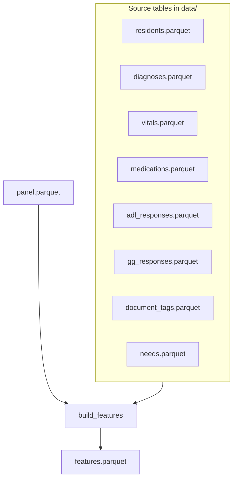
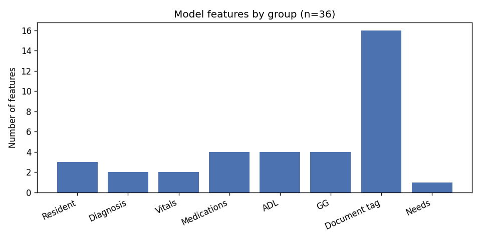
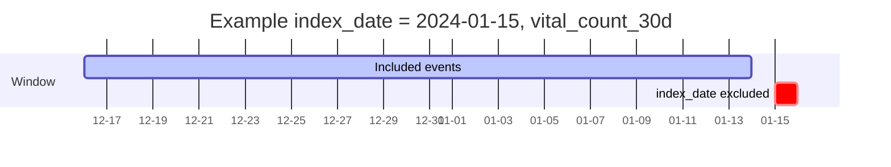
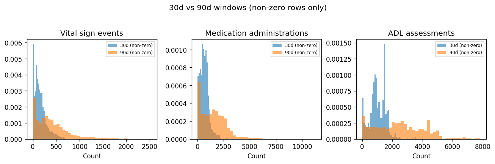
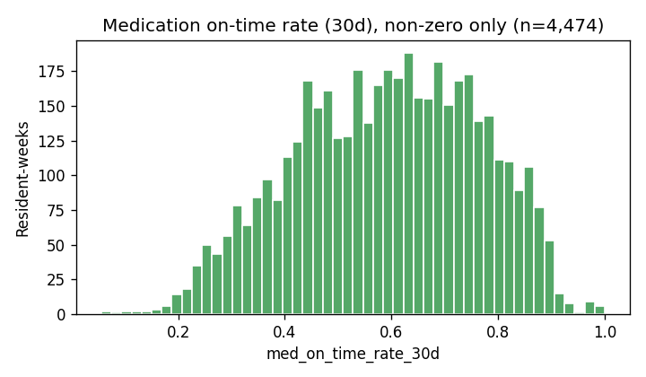
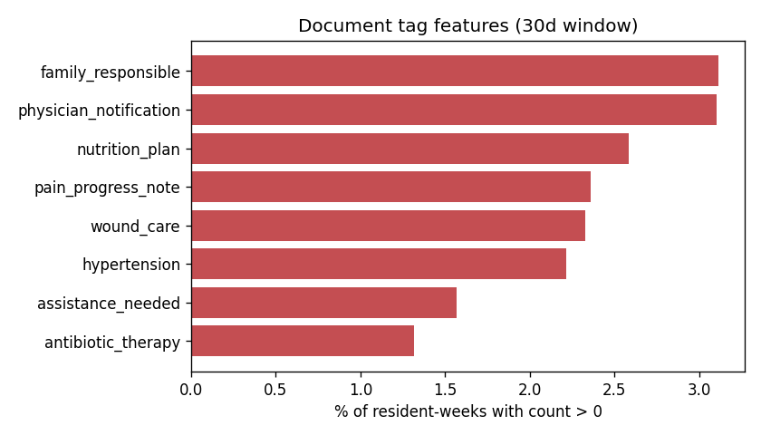

# Feature reference

This document describes the **34 numeric predictors** used by the incident-risk models. Features are built in [`src/features.py`](../src/features.py) from weekly resident-time rows in `artifacts/features.parquet` (117,291 rows in the current build).

## Overview

| Concept | Definition |
| -------- | ----------- |
| **Grain** | One row = one `resident_id` × weekly `index_date` while the resident is in-facility ([`src/labels.py`](../src/labels.py), `INDEX_FREQ = "W"`). |
| **Predictors** | 34 numeric columns selected by [`get_feature_matrix()`](../src/train.py) (IDs, dates, and all `y_*` labels excluded). |
| **Lookback windows** | 30 and 90 days before `index_date`, interval **`[index_date − w, index_date)`** — events on the index day are **not** included. |
| **Missing values** | Counts and rates are filled with **0** when no qualifying events exist. |
| **Strikeouts** | Rows with `strikeout = true` are dropped from source clinical tables where that column exists. |

### Data flow



### Leakage rule

**Labels** (`y_Fall`, `y_Wound`, `y_Altercation`, `y_any`) flag whether an incident occurs in **(index_date, index_date + 30 days]**. All features must use information available **strictly before** `index_date`.

---

## Master catalog (34 features)

| Feature | Readable name | Group | Source | Type | Window |
| ------- | ------------- | ----- | ------ | ---- | ------ |
| `outpatient` | Outpatient flag | Resident | `residents.parquet` | binary | as of index |
| `age_years` | Age at index (years) | Resident | `residents.parquet` | point-in-time | as of index |
| `days_since_admission` | Days since admission | Resident | `residents.parquet` | point-in-time | as of index |
| `dx_active_count` | Active diagnoses | Diagnosis | `diagnoses.parquet` | count | as of index |
| `dx_distinct_icd` | Distinct ICD codes | Diagnosis | `diagnoses.parquet` | distinct | as of index |
| `vital_count_30d` | Vital sign events (30d) | Vitals | `vitals.parquet` | count | 30d |
| `vital_count_90d` | Vital sign events (90d) | Vitals | `vitals.parquet` | count | 90d |
| `med_count_30d` | Medication administrations (30d) | Medications | `medications.parquet` | count | 30d |
| `med_on_time_rate_30d` | Medication on-time rate (30d) | Medications | `medications.parquet` | rate | 30d |
| `med_count_90d` | Medication administrations (90d) | Medications | `medications.parquet` | count | 90d |
| `med_on_time_rate_90d` | Medication on-time rate (90d) | Medications | `medications.parquet` | rate | 90d |
| `adl_count_30d` | ADL assessments (30d) | ADL | `adl_responses.parquet` | count | 30d |
| `adl_count_90d` | ADL assessments (90d) | ADL | `adl_responses.parquet` | count | 90d |
| `adl_change_sum_30d` | ADL change score sum (30d) | ADL | `adl_responses.parquet` | sum | 30d |
| `adl_change_sum_90d` | ADL change score sum (90d) | ADL | `adl_responses.parquet` | sum | 90d |
| `gg_count_30d` | Functional (GG) assessments (30d) | GG | `gg_responses.parquet` | count | 30d |
| `gg_count_90d` | Functional (GG) assessments (90d) | GG | `gg_responses.parquet` | count | 90d |
| `tag_pain_progress_note_30d` | Document tag (pain progress note 30d) | Document tag | `document_tags.parquet` | count | 30d |
| `tag_pain_progress_note_90d` | Document tag (pain progress note 90d) | Document tag | `document_tags.parquet` | count | 90d |
| `tag_wound_care_30d` | Document tag (wound care 30d) | Document tag | `document_tags.parquet` | count | 30d |
| `tag_wound_care_90d` | Document tag (wound care 90d) | Document tag | `document_tags.parquet` | count | 90d |
| `tag_nutrition_plan_30d` | Document tag (nutrition plan 30d) | Document tag | `document_tags.parquet` | count | 30d |
| `tag_nutrition_plan_90d` | Document tag (nutrition plan 90d) | Document tag | `document_tags.parquet` | count | 90d |
| `tag_physician_notification_30d` | Document tag (physician notification 30d) | Document tag | `document_tags.parquet` | count | 30d |
| `tag_physician_notification_90d` | Document tag (physician notification 90d) | Document tag | `document_tags.parquet` | count | 90d |
| `tag_family_responsible_30d` | Document tag (family responsible 30d) | Document tag | `document_tags.parquet` | count | 30d |
| `tag_family_responsible_90d` | Document tag (family responsible 90d) | Document tag | `document_tags.parquet` | count | 90d |
| `tag_assistance_needed_30d` | Document tag (assistance needed 30d) | Document tag | `document_tags.parquet` | count | 30d |
| `tag_assistance_needed_90d` | Document tag (assistance needed 90d) | Document tag | `document_tags.parquet` | count | 90d |
| `tag_hypertension_30d` | Document tag (hypertension 30d) | Document tag | `document_tags.parquet` | count | 30d |
| `tag_hypertension_90d` | Document tag (hypertension 90d) | Document tag | `document_tags.parquet` | count | 90d |
| `tag_antibiotic_therapy_30d` | Document tag (antibiotic therapy 30d) | Document tag | `document_tags.parquet` | count | 30d |
| `tag_antibiotic_therapy_90d` | Document tag (antibiotic therapy 90d) | Document tag | `document_tags.parquet` | count | 90d |
| `needs_active_count` | Active care needs | Needs | `needs.parquet` | count | as of index |

Document tags are the eight `tag_id` values in [`config.TOP_DOCUMENT_TAGS`](../config.py).



---

## Resident features (3)

Computed from `residents.parquet` at each `index_date`:

| Feature | Formula / rule |
| ------- | ---------------- |
| `age_years` | `(index_date − date_of_birth)` in days ÷ 365.25 |
| `days_since_admission` | `(index_date − admission_date)` in days |
| `outpatient` | `1` if outpatient flag is true, else `0` |

**Example (hypothetical):**

| Field | Value |
| ----- | ----- |
| `date_of_birth` | 1945-06-01 |
| `admission_date` | 2022-03-15 |
| `index_date` | 2023-11-26 |
| `outpatient` | false |

| Result | Value |
| ------ | ----- |
| `age_years` | ≈ 78.5 |
| `days_since_admission` | 621 |
| `outpatient` | 0 |

**Cohort distribution** (N = 117,291 resident-weeks):

| Feature | p25 | median | p75 | p95 | max | % non-zero |
| ------- | --- | ------ | --- | --- | --- | ---------- |
| `age_years` | 66.9 | 77.1 | 85.2 | 94.2 | 105.1 | 99.9% |
| `days_since_admission` | 180 | 480 | 1032 | 2521 | 7248 | 99.9% |
| `outpatient` | 0 | 0 | 0 | 0 | 1 | 4.5% |

---

## Diagnoses and care needs (3)

### Active-at-index logic

A diagnosis or care need counts for `index_date = t` when:

- `onset_at` / `initiated_at` **≤** `t`, and  
- `resolved_at` is **null** OR `resolved_at` **>** `t`

**Worked example — diagnoses** (`index_date = 2024-01-15`):

| ICD | onset_at | resolved_at | Active at index? |
| --- | -------- | ----------- | ---------------- |
| I10 | 2023-01-01 | (null) | Yes |
| E11 | 2023-06-01 | 2024-02-01 | Yes (resolved after index) |
| J44 | 2023-12-01 | 2024-01-10 | No (resolved before index) |
| M79 | 2024-01-20 | (null) | No (onset after index) |

→ `dx_active_count = 2`, `dx_distinct_icd = 2`

| Feature | Definition |
| ------- | ----------- |
| `dx_active_count` | Number of active diagnosis rows |
| `dx_distinct_icd` | Distinct `icd_10_code` among active rows |
| `needs_active_count` | Same “active” rule on `needs.parquet` |

| Feature | median | p75 | p95 | % non-zero |
| ------- | ------ | --- | --- | ---------- |
| `dx_active_count` | 10 | 19 | 33 | 71.6% |
| `dx_distinct_icd` | 10 | 18 | 31 | 71.6% |
| `needs_active_count` | 4 | 60 | 181 | 56.5% |

---

## Lookback window (all 30d / 90d features)

For window length `w`, events must satisfy:

```text
index_date − w  ≤  event_time  <  index_date
```



---

## Daily aggregation + window counts

**Applies to:** `vital_count_*`, `adl_count_*`, `gg_count_*`

**Steps:**

1. Collapse raw events to **one row per resident per calendar day** with count `_n` (multiple events the same day add to that day’s count).
2. Sum `_n` over all days in the lookback window.

**Important:** `vital_count_*` includes **all** vital types (blood pressure, temperature, pulse, etc.). `VITAL_TYPES_OF_INTEREST` in config is **not** used in the current pipeline.

**Walkthrough — `vital_count_30d`:**

| measured_at | Calendar day | Daily `_n` |
| ----------- | ------------ | ---------- |
| Jan 10 08:00 | Jan 10 | 3 |
| Jan 10 14:00 | Jan 10 | (same day) |
| Jan 10 20:00 | Jan 10 | (same day) |
| Jan 12 09:00 | Jan 12 | 2 |

If `index_date = Jan 15` and window = 30 days → `vital_count_30d = 3 + 2 = **5**` (not 5 raw rows counted twice on Jan 10).

| Feature | % non-zero | p75 (if >0) | p95 | max |
| ------- | ---------- | ----------- | --- | --- |
| `vital_count_30d` | 33.4% | 66 | 278 | 913 |
| `vital_count_90d` | 34.0% | 154 | 754 | 2530 |
| `adl_count_30d` | 1.1% | — | — | 3580 |
| `gg_count_30d` | 1.3% | — | — | 3094 |



---

## Medication features (4)

| Feature | Definition |
| ------- | ----------- |
| `med_count_*` | Sum of daily administration counts (daily aggregation, then sum over window) |
| `med_on_time_rate_*` | **Mean of daily on-time rates** in the window (not one global fraction) |

**Daily on-time rate:** For each calendar day, fraction of administrations whose `status` contains `"On Time"` (case-insensitive).

**Two-step example — `med_on_time_rate_30d`:**

| Day | Doses | On time | Daily rate |
| --- | ----- | ------- | ---------- |
| Mon | 4 | 3 | 0.75 |
| Tue | 2 | 2 | 1.00 |

→ `med_on_time_rate_30d = mean(0.75, 1.00) = **0.875**`

| Feature | % non-zero | max |
| ------- | ---------- | --- |
| `med_count_30d` | 3.8% | 4262 |
| `med_on_time_rate_30d` | 3.8% | 1.0 |



---

## ADL change sum (2)

| Feature | Definition |
| ------- | ----------- |
| `adl_change_sum_*` | **Sum** of `adl_change` on each assessment row in the window (no daily collapse) |

**Example:** assessments with `adl_change` = +1, −2, +1 → `adl_change_sum_30d = 0`

Most resident-weeks have zero ADL activity in the window (% non-zero ≈ 1%).

---

## Document tag features (16)

For each tag in `TOP_DOCUMENT_TAGS`, count tag matches in the lookback window.

| `tag_id` | Plain-language meaning |
| -------- | ---------------------- |
| `pain_progress_note` | Pain-related progress notes |
| `wound_care` | Wound care documentation |
| `nutrition_plan` | Nutrition plan |
| `physician_notification` | Physician notification |
| `family_responsible` | Family / responsible party |
| `assistance_needed` | Assistance needed |
| `hypertension` | Hypertension |
| `antibiotic_therapy` | Antibiotic therapy |

**Filters:** `deleted_at` is null; `match_confidence ≥ TAG_CONFIDENCE_MIN` (currently 0).

Tags are sparse: typically **1–4%** of resident-weeks have a non-zero count in the 30d window.

| Tag (30d) | % non-zero |
| --------- | ---------- |
| `tag_antibiotic_therapy_30d` | 1.3% |
| `tag_assistance_needed_30d` | 1.6% |
| `tag_hypertension_30d` | 2.2% |
| `tag_wound_care_30d` | 2.3% |
| `tag_pain_progress_note_30d` | 2.4% |
| `tag_nutrition_plan_30d` | 2.6% |
| `tag_physician_notification_30d` | 3.1% |
| `tag_family_responsible_30d` | 3.1% |



---

## Example resident-week (from data)

Illustrative row with high vitals, medications, diagnoses, tags, and needs (IDs truncated):

| Field | Value |
| ----- | ----- |
| `resident_id` | d9631253… |
| `index_date` | 2023-11-26 |
| `age_years` | 79.0 |
| `days_since_admission` | 446 |
| `dx_active_count` | 27 |
| `vital_count_30d` | 225 |
| `med_count_30d` | 797 |
| `med_on_time_rate_30d` | 0.38 |
| `tag_wound_care_30d` | 1 |
| `tag_physician_notification_30d` | 5 |
| `needs_active_count` | 381 |

---

## Distribution appendix (all 34)

Stats from `artifacts/features.parquet`. Many count features are zero-inflated (median = 0).

| Feature | min | p25 | median | p75 | p95 | max | % nz |
| ------- | --- | --- | ------ | --- | --- | --- | ---- |
| `outpatient` | 0 | 0 | 0 | 0 | 0 | 1 | 4.5 |
| `age_years` | 0 | 66.9 | 77.1 | 85.2 | 94.2 | 105.1 | 99.9 |
| `days_since_admission` | −1 | 180 | 480 | 1032 | 2521 | 7248 | 99.9 |
| `dx_active_count` | 0 | 0 | 10 | 19 | 33 | 75 | 71.6 |
| `dx_distinct_icd` | 0 | 0 | 10 | 18 | 31 | 67 | 71.6 |
| `vital_count_30d` | 0 | 0 | 0 | 66 | 278 | 913 | 33.4 |
| `vital_count_90d` | 0 | 0 | 0 | 154 | 754 | 2530 | 34.0 |
| `med_count_30d` | 0 | 0 | 0 | 0 | 0 | 4262 | 3.8 |
| `med_on_time_rate_30d` | 0 | 0 | 0 | 0 | 0 | 1 | 3.8 |
| `med_count_90d` | 0 | 0 | 0 | 0 | 0 | 11300 | 4.3 |
| `med_on_time_rate_90d` | 0 | 0 | 0 | 0 | 0 | 1 | 4.3 |
| `adl_count_30d` | 0 | 0 | 0 | 0 | 0 | 3580 | 1.1 |
| `adl_count_90d` | 0 | 0 | 0 | 0 | 0 | 7840 | 1.1 |
| `adl_change_sum_30d` | −127 | 0 | 0 | 0 | 0 | 102 | 1.0 |
| `adl_change_sum_90d` | −228 | 0 | 0 | 0 | 0 | 199 | 1.0 |
| `gg_count_30d` | 0 | 0 | 0 | 0 | 0 | 3094 | 1.3 |
| `gg_count_90d` | 0 | 0 | 0 | 0 | 0 | 8933 | 1.3 |
| `tag_pain_progress_note_30d` | 0 | 0 | 0 | 0 | 0 | 274 | 2.4 |
| `tag_pain_progress_note_90d` | 0 | 0 | 0 | 0 | 0 | 314 | 3.3 |
| `tag_wound_care_30d` | 0 | 0 | 0 | 0 | 0 | 151 | 2.3 |
| `tag_wound_care_90d` | 0 | 0 | 0 | 0 | 0 | 184 | 3.5 |
| `tag_nutrition_plan_30d` | 0 | 0 | 0 | 0 | 0 | 35 | 2.6 |
| `tag_nutrition_plan_90d` | 0 | 0 | 0 | 0 | 0 | 44 | 4.0 |
| `tag_physician_notification_30d` | 0 | 0 | 0 | 0 | 0 | 145 | 3.1 |
| `tag_physician_notification_90d` | 0 | 0 | 0 | 0 | 0 | 145 | 4.3 |
| `tag_family_responsible_30d` | 0 | 0 | 0 | 0 | 0 | 150 | 3.1 |
| `tag_family_responsible_90d` | 0 | 0 | 0 | 0 | 0 | 150 | 4.2 |
| `tag_assistance_needed_30d` | 0 | 0 | 0 | 0 | 0 | 247 | 1.6 |
| `tag_assistance_needed_90d` | 0 | 0 | 0 | 0 | 0 | 255 | 2.6 |
| `tag_hypertension_30d` | 0 | 0 | 0 | 0 | 0 | 219 | 2.2 |
| `tag_hypertension_90d` | 0 | 0 | 0 | 0 | 0 | 239 | 2.7 |
| `tag_antibiotic_therapy_30d` | 0 | 0 | 0 | 0 | 0 | 147 | 1.3 |
| `tag_antibiotic_therapy_90d` | 0 | 0 | 0 | 0 | 0 | 147 | 2.1 |
| `needs_active_count` | 0 | 0 | 4 | 60 | 181 | 551 | 56.5 |

---

## What is not a model feature

These columns appear in `features.parquet` but are **not** fed to the model:

| Column | Role |
| ------ | ---- |
| `resident_id`, `facility_id` | Identifiers |
| `index_date` | Panel time index |
| `y_Fall`, `y_Wound`, `y_Altercation` | Multi-label targets (30-day forward) |
| `y_any` | Union of the three targets |

---

## Related code

| File | Purpose |
| ---- | ------- |
| [`src/features.py`](../src/features.py) | Feature engineering |
| [`config.py`](../config.py) | Windows, document tags, readable name prefixes |
| [`src/counterfactual.py`](../src/counterfactual.py) | Percentile grids on train reference distributions of these same columns |

---

## Updating this doc

After rebuilding features:

```bash
python -m src.features
python scripts/feature_doc_stats.py
```

This refreshes `docs/feature_doc_stats.json` and `docs/figures/*.png`. Update distribution tables in this file if cohort size or feature logic changes materially.
